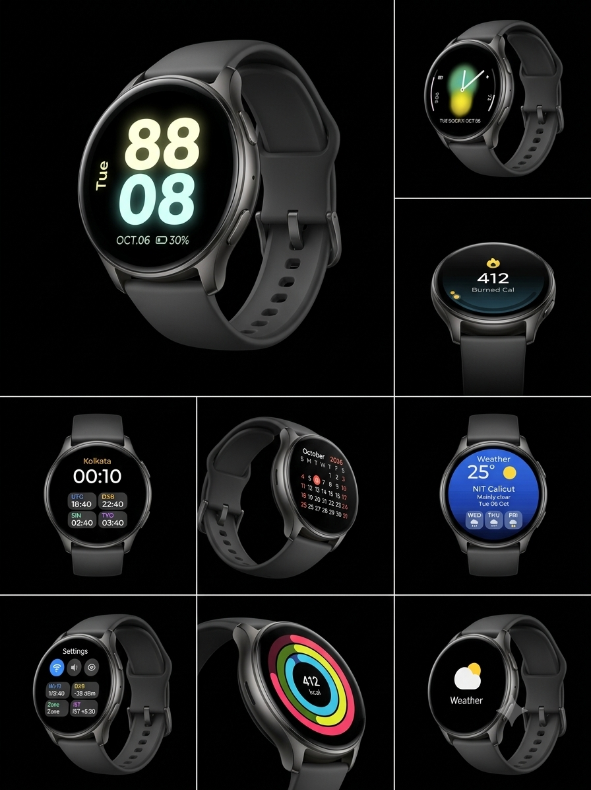

<div align="center">

# Smartwatch Firmware

**A round-display smartwatch UI for the ESP32, built on ESP-IDF and LVGL 9.**




<sub>UI concept renders. They show the design target; the screens currently shipped are listed under [Features](#features).</sub>

</div>

---

## Table of contents

- [Overview](#overview)
- [Features](#features)
- [Hardware](#hardware)
- [Getting started](#getting-started)
- [Controls](#controls)
- [Configuration](#configuration)
- [Project structure](#project-structure)
- [Architecture](#architecture)
- [Adding a new app](#adding-a-new-app)
- [Weather service](#weather-service)
- [Troubleshooting](#troubleshooting)
- [Known limitations](#known-limitations)
- [Roadmap](#roadmap)
- [Acknowledgements](#acknowledgements)
- [License](#license)

---

## Overview

This project turns an ESP32 and a 1.28" round GC9A01 display into a smartwatch-style
interface with watch faces, an activity page, a honeycomb app launcher and a set of
apps. Time comes from the network (SNTP), weather comes from the internet, and the
whole UI runs on LVGL with smooth, animated transitions.

The codebase is split into small modules (display, network, UI, one file per app) so
that adding a screen or an app means adding one file, not editing a monolith.

## Features

### Watch faces and pages

| Page | What it shows |
|---|---|
| **Digital face** | Large hours (white) and minutes (orange), blinking colon, date header, slim seconds ring, steps and heart-rate complications |
| **Analog face** | Minimal ticks, 12/3/6/9 numerals, date pill, smooth sweeping hour, minute and second hands |
| **Activity** | Three animated concentric rings (move, exercise, stand) with calories in the centre |
| **App launcher** | Honeycomb grid of 8 apps; the focused icon grows with a highlight ring |

### Apps

| App | Status |
|---|---|
| **Weather** | Live conditions for **NIT Calicut** (temperature, condition, high/low, humidity, wind) with a drawn icon and a background that changes with the weather |
| **World Time** | Live UTC, Dubai, Singapore and Tokyo clocks |
| **Calendar** | Today's date; the launcher icon updates itself every minute |
| **Settings** | Live Wi-Fi network name and signal strength, time zone, display info |
| **Fitness** | Demo data (no sensor connected yet) |
| **Phone** | Placeholder page |
| **Wallet** | Placeholder page |
| **Workout** | Placeholder page |

### Platform

- Wi-Fi station mode with automatic reconnect
- SNTP time sync, India Standard Time (IST, UTC+5:30)
- Partial-buffer, DMA, double-buffered rendering for a responsive UI on a no-PSRAM ESP32
- Fully custom icons drawn from LVGL shapes (no image assets, no flash cost)
- Swipe-ready tile navigation (button-driven today, touch-ready)

## Hardware

### Bill of materials

| Part | Notes |
|---|---|
| ESP32 dev board | Tested on an ESP32-D0WD-V3 (revision v3.1) |
| GC9A01 round display | 240x240, SPI, 1.28" |
| USB cable | For power, flashing and serial logs |

No PSRAM or touch controller is required.

### Default wiring

| GC9A01 | ESP32 |
|---|---|
| VCC | 3V3 |
| GND | GND |
| SCL | GPIO 22 |
| SDA | GPIO 21 |
| CS | GPIO 2 |
| DC | GPIO 4 |
| RST | GPIO 23 |
| BLK | 3V3 (always on) |

The page button is the on-board **BOOT** button (GPIO 0). Pins are set in
`include/specs.h`.

## Getting started

### Prerequisites

- [ESP-IDF v5.2](https://docs.espressif.com/projects/esp-idf/en/v5.2/esp32/get-started/index.html) installed and exported
- A 2.4 GHz Wi-Fi network with internet access (the ESP32 does not support 5 GHz)
- Python and Git (installed with ESP-IDF)

Dependencies (LVGL, `esp_lvgl_port`, the GC9A01 driver) are downloaded automatically
by the ESP-IDF component manager on the first build.

### Build and flash

```powershell
# 1. Set your Wi-Fi credentials (see Configuration), then:
idf.py set-target esp32
idf.py build
idf.py -p COM3 flash monitor
```

Replace `COM3` with your serial port (`/dev/ttyUSB0` on Linux, `/dev/cu.usbserial-*`
on macOS). Press `Ctrl+]` to leave the serial monitor.

### First run

1. The screen lights up immediately and shows `--:--` with "Syncing...".
2. The watch joins Wi-Fi, syncs the clock and the real time appears (a few seconds).
3. The weather page fills in as soon as the first request completes.

### Clean rebuild after changing configuration

`sdkconfig.defaults` is only applied when no `sdkconfig` exists, so after editing it:

```powershell
Remove-Item sdkconfig
idf.py build
```

## Controls

The watch is operated with a single button, so the interface is built around it.
Real swipes work as soon as a touch controller is added (see the [Roadmap](#roadmap)).

| Where you are | Short press | Long press (0.6 s) |
|---|---|---|
| Watch faces / activity | Next page | Jump to the app launcher |
| App launcher | Move the highlight to the next app | Open the highlighted app |
| Inside an app | Go back | Go back |

After the last app in the launcher, a short press returns to the watch face.

## Configuration

| Setting | Where | Default |
|---|---|---|
| Wi-Fi name and password | Network module (`src/network.c` / `include/network.h`) | none, set before flashing |
| Time zone | Network module (`TZ_STRING`) | `IST-5:30` |
| Display pins, SPI clock, resolution | `include/specs.h` | see [wiring](#default-wiring) |
| Rotation | `include/specs.h` (`ROT_SWAP_XY`, `ROT_MIRROR_X`, `ROT_MIRROR_Y`) | 90° |
| Button pin and long-press time | `include/specs.h` | GPIO 0, 600 ms |
| Weather location | `include/weather.h` (`WEATHER_LAT`, `WEATHER_LON`, `WEATHER_PLACE`) | NIT Calicut |
| Demo health values | `include/mock_data.h` | demo data |
| Colour theme | `include/ui_common.h` | black with orange accent |

> **Security:** do not commit real Wi-Fi credentials. Keep them in an untracked file
> (add it to `.gitignore`) or move them to `idf.py menuconfig`.

### Rotation reference

| Orientation | `swap_xy` | `mirror_x` | `mirror_y` |
|---|---|---|---|
| Current default | false | false | true |

If the image comes out 90° the wrong way, flip `mirror_y` to `false` and `mirror_x`
to `true`.

## Project structure

```text
.
├── main/
│   ├── CMakeLists.txt
│   ├── idf_component.yml        # managed dependencies (LVGL, esp_lvgl_port, GC9A01)
│   └── main.c                   # entry point only
├── include/
│   ├── display.h                # GC9A01 + LVGL port
│   ├── network.h                # Wi-Fi + SNTP
│   ├── specs.h                  # pins, resolution, rotation, button
│   ├── ui.h                     # UI entry point
│   ├── ui_common.h              # theme + shared drawing helpers
│   ├── menu.h                   # app interface (menu_app_t)
│   ├── weather.h                # weather data API + location
│   └── mock_data.h              # demo health values
├── src/
│   ├── display.c
│   ├── network.c
│   ├── ui.c                     # pages, launcher, navigation
│   ├── ui_common.c
│   ├── weather.c                # background fetch task (Open-Meteo)
│   └── menu/                    # one file per app
│       ├── menu_fitness.c
│       ├── menu_phone.c
│       ├── menu_world_time.c
│       ├── menu_wallet.c
│       ├── menu_calendar.c
│       ├── menu_weather.c
│       ├── menu_workout.c
│       └── menu_settings.c
├── docs/
│   └── images/
│       └── preview.png
├── sdkconfig.defaults
└── README.md
```

## Architecture

```text
            ┌──────────────────────────────┐
            │            main.c            │   entry point
            └──────────────┬───────────────┘
                           │
        ┌──────────────────┼───────────────────┐
        ▼                  ▼                   ▼
  ┌───────────┐     ┌─────────────┐     ┌─────────────┐
  │ display.c │     │  network.c  │     │    ui.c     │
  │ SPI, GC9A01│    │ Wi-Fi, SNTP │     │ pages,      │
  │ LVGL port │     └──────┬──────┘     │ launcher,   │
  └───────────┘            │ clock      │ navigation  │
                           ▼            └──────┬──────┘
                    ┌─────────────┐            │ menu_app_t
                    │  weather.c  │◄───────────┤
                    │ HTTPS fetch │     ┌──────▼───────┐
                    │ task        │     │ src/menu/*.c │
                    └─────────────┘     │ one per app  │
                                        └──────────────┘
```

**Responsibilities**

- `display.c` owns the SPI bus, the GC9A01 panel and the LVGL port (flush, tick, task).
- `network.c` owns Wi-Fi, reconnects and SNTP. Once the clock is set, everything that
  needs "real time" simply reads the system time.
- `weather.c` runs its own low-priority task. It waits for the clock to sync (proof
  that the internet works), then fetches and caches weather. The UI only reads the
  cached copy, so it never blocks on the network.
- `ui.c` builds the pages and the launcher and routes button input. It knows apps only
  through the `menu_app_t` interface, never their internals.
- `src/menu/` holds each app's icon and page in isolation.

**Threading rule:** all LVGL calls outside the LVGL task must hold
`lvgl_port_lock()` / `lvgl_port_unlock()`. UI timers already run inside the LVGL task.

**Rendering notes**

- 40-line partial draw buffers, double-buffered, DMA-capable.
- Labels and hands are updated only when their value changes, to minimise redraws.
- The launcher grows icons by animating their size rather than using transforms,
  which avoids extra layer memory on a no-PSRAM chip.

## Adding a new app

An app is one file in `src/menu/` that exports a `menu_app_t`.

**1. Create `src/menu/menu_notes.c`:**

```c
#include "menu.h"
#include "ui_common.h"

static void notes_icon(lv_obj_t *icon)
{
    ui_shape(icon, 24, 28, 4, COL_TEXT, 0, 0);          /* draw the glyph */
}

static void notes_open(lv_obj_t *page)
{
    lv_obj_t *body = ui_body_label(page);
    lv_label_set_text(body, "No notes yet");
}

const menu_app_t menu_notes_app = {
    .title      = "Notes",
    .color      = 0xFFB300,
    .build_icon = notes_icon,
    .open       = notes_open,
};
```

**2. Declare it in `include/menu.h`** (`extern const menu_app_t menu_notes_app;`) and
add an entry to the `menu_item_t` enum.

**3. Register it in `src/ui.c`** (the app table and its honeycomb position).

**Available hooks**

| Hook | When it runs | Required |
|---|---|---|
| `build_icon` | Once, when the launcher is built | yes |
| `open` | When the app page opens | no |
| `refresh` | Once per second while the page is open | no |
| `close` | When the page closes (widgets are deleted afterwards) | no |
| `on_minute` | Every minute, even when closed | no |
| `fullscreen` | Hides the standard title bar so the app draws its own header | no |

`src/menu/` is picked up by the build automatically; no CMake change is needed.

## Weather service

| | |
|---|---|
| **Provider** | [Open-Meteo](https://open-meteo.com), free, no API key |
| **Location** | NIT Calicut (configurable in `include/weather.h`) |
| **Data** | Temperature, condition (WMO code), day/night, humidity, wind speed, daily high and low |
| **Refresh** | Every 15 minutes, retry after 30 seconds on failure, refresh on opening the page when data is older than 10 minutes |
| **Transport** | HTTPS using the ESP-IDF certificate bundle |
| **Parsing** | cJSON |

The page picks a drawn icon (sun, moon, partly cloudy, cloud, fog, rain, snow,
thunderstorm) and a matching background gradient from the weather code, and shows
"Fetching..." until the first response arrives.

**Memory:** the TLS connection needs a noticeable chunk of heap on a no-PSRAM ESP32.
If you see allocation failures in the log, lower the LVGL memory pool or reduce the
mbedTLS buffer sizes in `menuconfig`.

## Troubleshooting

| Symptom | Likely cause and fix |
|---|---|
| Blank screen | Check wiring against the [table](#default-wiring); make sure BLK is powered |
| Colours inverted | Toggle `esp_lcd_panel_invert_color(panel, true/false)` in `display.c` |
| Red and blue swapped | Change `rgb_ele_order` to `LCD_RGB_ELEMENT_ORDER_RGB` |
| Garbled or noisy image | Lower `LCD_PIXEL_CLK_HZ` to 27 MHz |
| Image rotated or mirrored | Adjust the rotation flags in `specs.h` |
| Stuck on `--:--` / "Syncing..." | Wi-Fi joined but no internet (check hotspot data), wrong credentials, or a 5 GHz-only network |
| `app partition is too small` | Make sure `sdkconfig.defaults` is applied (delete `sdkconfig`, rebuild) |
| Weather shows "Fetching..." forever | No internet, TLS memory failure (see above), or the API is unreachable |
| Build error about `RGB565_SWAPPED` | LVGL older than 9.3; keep `lvgl/lvgl` at `^9.3.0` |
| Serial monitor looks frozen after boot | Normal: the app logs nothing once running. Leave it with `Ctrl+]` |
| Port busy on flash | Close the serial monitor and any other program using the port |

## Known limitations

- **Health data is demo data.** Steps, heart rate, calories and the activity rings use
  values from `mock_data.h` until real sensors are connected.
- **No touch input yet.** Navigation is button-driven; the tile layout is ready for swipes.
- **Phone, Wallet and Workout are placeholders.**
- **World Time** uses fixed offsets for cities without daylight saving, so it stays
  correct all year but does not include DST-observing cities.
- **Weather is a single fixed location** and needs an internet connection.
- **The UI concept renders** at the top of this README show a design target (for
  example a month-grid calendar and a multi-day forecast) that is more detailed than
  what is implemented today.

## Roadmap

- [ ] Touch driver (CST816S) for real swipe navigation
- [ ] Real step counter and heart-rate sensor (IMU / PPG)
- [ ] Month-grid calendar and multi-day weather forecast
- [ ] Settings toggles (Wi-Fi, brightness, sound)
- [ ] RTC (DS3231 / PCF8563) for time without Wi-Fi
- [ ] Battery gauge and low-power sleep with an always-on display mode
- [ ] Credentials via Kconfig / provisioning instead of source defines
- [ ] Workout tracking and a music-control page

## Acknowledgements

- [LVGL](https://lvgl.io) (MIT): the graphics library behind every screen
- [Espressif ESP-IDF](https://github.com/espressif/esp-idf) (Apache-2.0) and the
  `esp_lvgl_port` and `esp_lcd_gc9a01` components
- [Open-Meteo](https://open-meteo.com): weather data, licensed
  [CC BY 4.0](https://creativecommons.org/licenses/by/4.0/); attribution is required
  if you redistribute or publish a product that uses this data

## License

Add your license here (for example MIT or Apache-2.0) and include a `LICENSE` file in
the repository root.